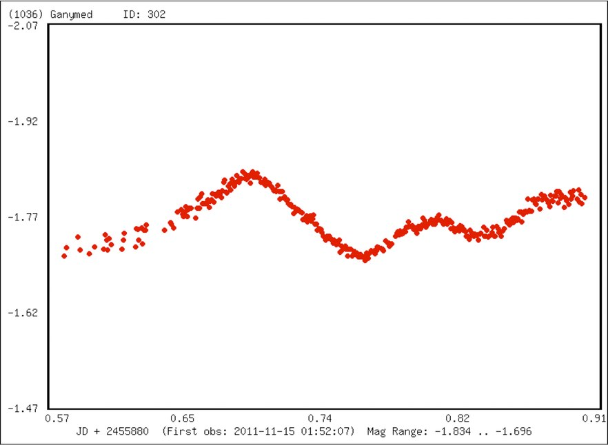
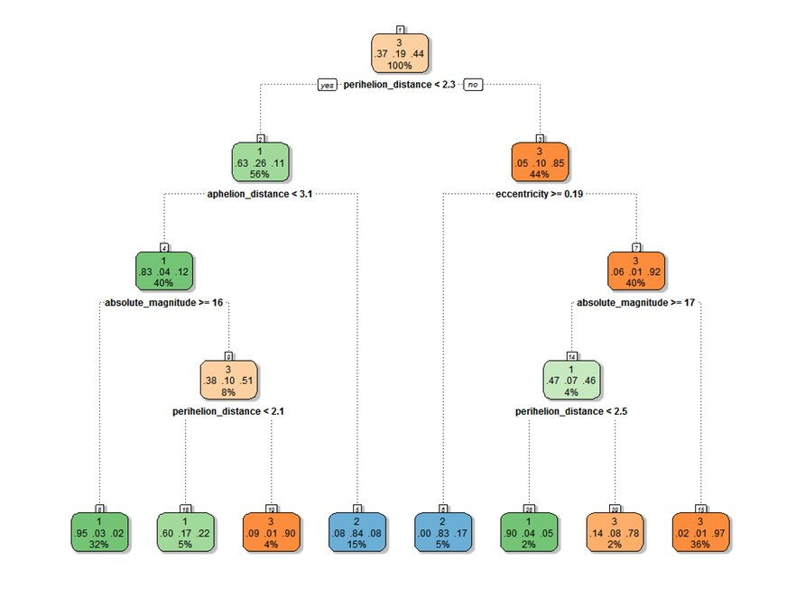

# SoaceShield, NASA SpaceApps 2015 entry
## Neuromorphic Studies of Asteroid Imagery.

Our world is immensely fragile. One of the greatest existential threats (except for the ones we generate ourselves) comes from the space. NEO's (near-earth objects) such as asteroids and comets pose the same danger to our planet as they did before billion years ago. Latest events around the world (Chelyabinsk meteorite i.e.) has shown the scale of such danger. This makes study of these threats an essential purpose of world's astronomical and aerospace community.

In this project our team developed a set of characterization models, which use different machine learning algorithms for characterization of some of the key parameters of asteroids such as potential hazardousness to Earth and predicting orbit types. According to our rough estimation, our models are able to save NASA dozens years of extra analysis and research work.

## Data and Data Preparation
We combine 2 datasets to train our models: a dataset with asteroid properties, and a dataset of lightcurve (light intensity as a function of time) measurements.

Properties include all of the known characteristics of around 680 000 asteroids, including: orbits, albedos and sizes, colors and spins. In total, there are approximately 50 different characteristics, some of which are shown on the picture below.

  

An example of lightcurve measurements is below.

  

Data pre-processing steps:

1) Excluding variables with 70% or more unknown values
2) Imputing missing variables using KNN imputation with K=3
3) Normalizing the data: centering and scaling
4) Using principal component analysis retaining 99% of variance

## Orbit type predictions

To predict asteroid orbit types, we used 5 machine learning algorithms, below are the RMSE values for each of them.

1) Generalised linear model, RMSE = 8.416011
2) Bayesian Regularized Neural Network, RMSE = 2.075327
3) Neural Network, RMSE = 1.795411
4) Conditional inference tree, RMSE = 1.642696
5) Random forest, RMSE = 0.4397909

We have been able to make a model for predicting asteroids' orbit types based on lightcurves only with accuracy of 93% using random forest model.

## Clustering of the unclassified main-belt asteroids

Finally, we used k-means clustering to look into subset of unclassified asteroids. Below is the proposed decision tree for separating unclassified asteroids into 3 distinct groups based on 4 keyparameters: perihelion distance, aphelion distance, eccentricity, and absolute magnitude.

## Final words

_"To be glad of life, because it gives you the chance to love and to work and to play and to look up at the stars", Henry Van Dyke_

